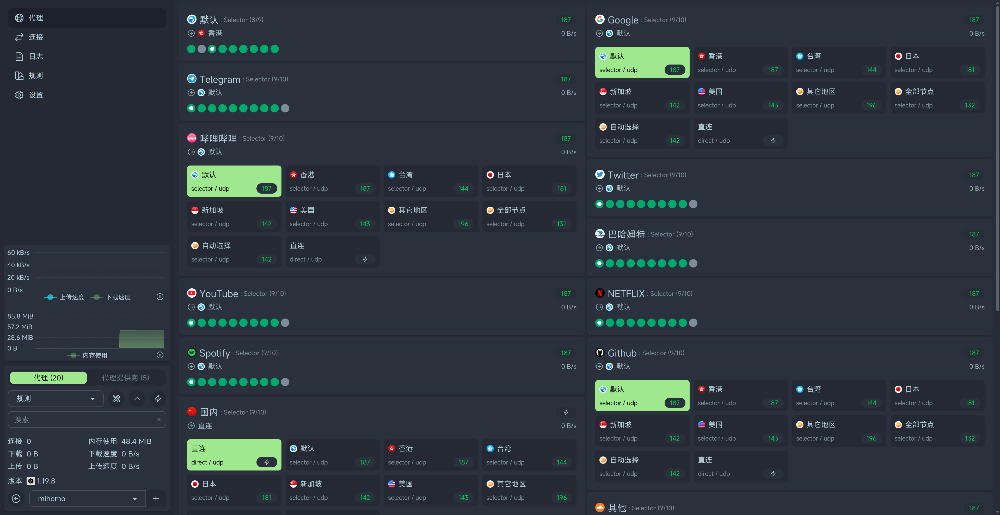
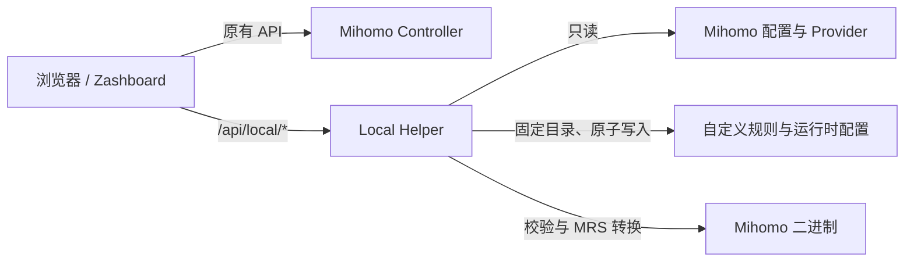

# Zashboard Rule Intelligence

这是一个以 [Zephyruso/zashboard](https://github.com/Zephyruso/zashboard) 为上游、面向裸 Mihomo
部署的增强版本。

```text
Project version: v1.0.0
Based on Zephyruso/zashboard v3.24.0 (f6dd9c07)
```

项目版本与上游基线是两个独立概念。本项目保留上游的 Dashboard、Proxies、Connections、Logs、
Rules、DNS 和 Settings，并以低耦合方式加入 Rule Intelligence 以及一个最小 Local Helper。

<p align="center">
  
  
</p>

> 本仓库通过项目 Git 标签提供源码版本，不提供预构建容器镜像或公共在线实例。不要把上游
> zashboard 的 Release、GHCR 镜像或在线站点误认为包含本项目的 Rule Intelligence 功能。

## 项目边界

本项目适合已经运行 Mihomo、希望在 zashboard 中检查规则和最终出站，并愿意在 Mihomo 同机
运行一个小型 Node.js Helper 的用户。它不是 Mihomo 发行版、订阅转换器、节点供应服务、
OpenClash/Nikki 管理器，也不会接管 Mihomo 的 Controller API。

浏览器仍然直接使用 zashboard 原有 Mihomo 客户端访问 Controller。Local Helper 只处理浏览器
做不到的本地文件和 CLI 操作：发现配置和 Provider、读取受限目录、转换 MRS、维护固定的
Pre/Post 自定义规则文件、执行 `mihomo -t` 校验。它不会代理 `/rules`、`/proxies`、
`/connections` 或 `/logs`。



## 已有功能

- 代理链/策略穿透：解析代理组到最终节点，并报告循环或缺失节点。
- Fallback 检测：识别第一个启用的 `MATCH` 或 `FINAL` 规则。
- Domain、IP/CIDR 和关键字规则搜索，覆盖直接规则及可读取的 Rule Provider。
- 有效规则穿透：按真实顺序解释最早可确定的规则、目标策略、代理链和最终出站。
- Text、YAML 及 `domain`/`ipcidr` MRS Provider 的统一解析与缓存。
- Rule Provider Explorer：类型计数、搜索、稳定排序、原文复制和 Helper 端分页。
- 裸 Mihomo Pre/Post 自定义规则：固定文件、并发版本检查、`mihomo -t` 校验、原子保存、
  有界备份和失败回滚；源配置始终只读。
- zashboard 上游原有功能、响应式界面和 PWA 行为。

详细行为、Helper API 和安全边界见
[`docs/rule-intelligence.md`](./docs/rule-intelligence.md)。

## 支持范围与前置条件

公开安装脚本当前支持：

- Linux 主机，使用 systemd；主要目标是 Debian/Ubuntu、普通 VPS 和 systemd LXC。
- 已经安装并可正常运行的 Mihomo。安装脚本不会安装或配置 Mihomo。
- Node.js `22.18` 或更新版本。
- 构建机使用仓库 `packageManager` 字段固定的 pnpm 版本；建议通过 Corepack 自动选择。
- x86_64、aarch64 等 Node.js 与 Mihomo 同时支持的架构；项目本身不携带架构相关二进制。
- Chrome 111+、Firefox 128+、Safari 16.4+。上游已知不支持 iOS 16.4 越狱环境。

Alpine/OpenRC、Docker 一体化镜像、Windows 服务和 NAS 厂商专用环境没有纳入公开安装脚本的
验证范围。仓库保留的 Dockerfile 只构建 `no-fonts` 静态 UI，不包含 Local Helper，也没有发布到
任何镜像仓库。纯静态 UI 可由任意 Web Server 托管，但 Rule Intelligence 的本地 Provider、MRS
和自定义规则功能需要在 Mihomo 主机另行运行 Local Helper。

## 快速安装

先以普通用户构建。不要用 `sudo pnpm install`，也不要把任何 Controller secret 写入 `.env`：

```bash
git clone https://github.com/CRISKAKA78/zashboard.git
cd zashboard
corepack enable
pnpm install --frozen-lockfile
cp .env.example .env.local
pnpm build:no-fonts
```

然后用实际路径安装静态 UI 和 Helper：

```bash
sudo bash deploy/install.sh \
  --mihomo-config /etc/mihomo/config.yaml \
  --mihomo-binary /usr/bin/mihomo \
  --rules-dir /etc/mihomo/rules \
  --custom-rules-dir /etc/mihomo/custom
```

安装器会：

1. 验证构建产物、Node.js、Mihomo 配置和二进制；
2. 把 Helper 按 Git commit 安装到 `/opt/zashboard-helper/releases/<commit>`；
3. 创建权限为 `0600` 的 `/etc/zashboard-helper/zashboard-helper.env`；
4. 安装并启动经过沙箱限制的 `zashboard-helper.service`；
5. 原子部署静态 UI 到 `/usr/share/zashboard`；
6. 检查 `/api/local/health`。

安装器**不会**编辑 Mihomo 配置、Controller secret、DNS、TUN、端口、代理组或规则，也不会重启
Mihomo。若目标 UI 目录已有其他面板，安装会拒绝覆盖；只有显式使用 `--replace-ui` 才会先把
旧目录移到 `/var/backups/zashboard/`。

安装完成后，自行让 Web Server 指向 `/usr/share/zashboard`，或把 Mihomo 的配置调整为：

```yaml
external-ui: /usr/share/zashboard
```

Mihomo 配置变更和重启由用户按自己的发行版流程执行。

### 让自定义规则在 Mihomo 重启后继续生效

Helper 的 `MIHOMO_CONFIG_PATH` 必须始终指向只读源配置。第一次在面板保存自定义规则后，Helper
会生成 `<MIHOMO_CUSTOM_RULES_DIR>/runtime-config.yaml` 并通过现有 Controller 客户端立即加载。
若 Mihomo 服务重启时仍读取源配置，本次自定义规则不会自动恢复。

需要持久化时，先确认运行时配置已经生成并通过校验，再检查你的真实 unit：

```bash
sudo test -f /etc/mihomo/custom/runtime-config.yaml
systemctl cat mihomo.service
```

然后按实际 unit 创建 drop-in，使 Mihomo 的启动命令使用运行时配置。下面只是一种常见形式，
`ExecStart`、工作目录和参数必须以你机器上的 unit 为准：

```ini
[Service]
ExecStart=
ExecStart=/usr/bin/mihomo -d /etc/mihomo -f /etc/mihomo/custom/runtime-config.yaml
```

源配置或订阅更新后，应在面板重新保存自定义规则，让 Helper 以新源配置重建并校验运行时配置。
公开安装器不会自动创建这类 Mihomo drop-in，因为不同发行版的 unit 和启动参数并不一致。

## 推荐部署：同源反向代理

最安全、也最简单的方式是让 Helper 保持默认 `127.0.0.1:8787`，由提供 UI 的 Web Server 只反向
代理 `/api/local/`。浏览器不会直接接触 Helper 端口，`VITE_LOCAL_HELPER_URL` 保持为空。

下面是一个最小 Nginx 片段；TLS、域名和访问控制应按实际环境补充：

```nginx
server {
    listen 80;
    server_name dashboard.example.net;
    root /usr/share/zashboard;

    location / {
        try_files $uri $uri/ /index.html;
    }

    location /api/local/ {
        proxy_pass http://127.0.0.1:8787;
        proxy_set_header Host $host;
        proxy_set_header X-Forwarded-Proto $scheme;
    }
}
```

Controller 地址和 secret 仍在 zashboard 的连接界面中配置。不要把 secret 放进仓库、构建参数、
URL 示例、Nginx 配置或 Helper EnvironmentFile。

## 直接使用 Mihomo `external-ui`

若 UI 由 Mihomo Controller 端口直接提供，浏览器访问 Helper 通常会变成跨源请求。构建时设置
Helper 的明确 URL：

```bash
VITE_LOCAL_HELPER_URL=http://192.0.2.10:8787 pnpm build:no-fonts
```

安装时把 Helper 绑定到实际可达地址，并只允许面板的精确 Origin：

```bash
sudo bash deploy/install.sh \
  --mihomo-config /etc/mihomo/config.yaml \
  --mihomo-binary /usr/bin/mihomo \
  --helper-host 192.0.2.10 \
  --helper-port 8787 \
  --allowed-origins http://192.0.2.10:9090
```

公开安装器拒绝通配符 Origin；非回环监听若没有至少一个精确 Origin 也会失败。请同时使用主机
防火墙限制 Helper 端口。跨公网部署应使用 TLS 反向代理，不应直接暴露明文 Helper。

## 配置

前端只有一个构建时变量：

| 变量 | 默认值 | 用途 |
| --- | --- | --- |
| `VITE_LOCAL_HELPER_URL` | 空 | 空值使用面板同源的 `/api/local/*`；跨源部署填写 Helper 基础 URL |

Helper 的所有运行参数如下。示例文件是
[`deploy/zashboard-helper.env.example`](./deploy/zashboard-helper.env.example)：

| 变量 | 默认值 | 用途 |
| --- | --- | --- |
| `MIHOMO_CONFIG_PATH` | `/etc/mihomo/config.yaml` | 只读的 Mihomo 源配置 |
| `MIHOMO_BINARY` | `/usr/bin/mihomo` | 配置校验和 MRS 转换使用的 Mihomo |
| `MIHOMO_RULES_DIR` | `<配置目录>/rules` | Provider 文件允许读取的根目录 |
| `MIHOMO_CUSTOM_RULES_DIR` | `<配置目录>/custom` | 固定自定义规则、备份及运行时配置目录 |
| `LOCAL_HELPER_HOST` | `127.0.0.1` | Helper 监听地址 |
| `LOCAL_HELPER_PORT` | `8787` | Helper 监听端口 |
| `LOCAL_HELPER_ALLOWED_ORIGINS` | 空 | 逗号分隔的精确跨源 Origin；同源请求仍允许 |
| `LOCAL_HELPER_MAX_PROVIDER_BYTES` | `8388608` | 单个 Provider 最大读取字节数 |
| `LOCAL_HELPER_MRS_TIMEOUT_MS` | `15000` | MRS 转换超时，范围 100–120000 ms |
| `LOCAL_HELPER_CONFIG_VALIDATION_TIMEOUT_MS` | `20000` | `mihomo -t` 超时，范围 100–120000 ms |
| `LOCAL_HELPER_CUSTOM_RULES_BACKUPS` | `3` | 自定义规则备份数量，范围 1–20 |
| `LOCAL_HELPER_MAX_REQUEST_BYTES` | `524288` | 自定义规则请求体上限，范围 1024–4194304 字节 |

首次安装可用同名环境变量覆盖限制值。升级默认保留已有 EnvironmentFile；需要改变路径或参数时，
传入新参数并显式加 `--reconfigure`。不要在该文件中添加 Controller secret。

可用 `bash deploy/install.sh --help` 查看路径、升级、暂不启动和打包暂存选项。

## 升级

本项目不会自动拉取或自动部署。推荐按 GitHub 发布标签升级；先查看发布说明并备份自己的
Helper EnvironmentFile、自定义规则和 Web Server 配置，然后在普通用户下获取并检出目标版本：

```bash
git fetch --tags origin
git switch --detach v1.0.0
pnpm install --frozen-lockfile
pnpm build:no-fonts
sudo bash deploy/install.sh \
  --upgrade \
  --mihomo-config /etc/mihomo/config.yaml \
  --mihomo-binary /usr/bin/mihomo \
  --rules-dir /etc/mihomo/rules \
  --custom-rules-dir /etc/mihomo/custom
```

将 `v1.0.0` 替换为准备安装的发布标签。若你明确选择跟踪 `main`，可使用
`git switch main && git pull --ff-only origin main`，但 `main` 可能包含尚未打标签的后续提交。

安装器先准备新的 commit 目录，再切换 `current` 符号链接；原 UI 会进入备份。systemd 启动或健康
检查失败时会恢复此前的 Helper 链接和 UI。高级环境参数默认不会在升级时被覆盖。

## 卸载

默认卸载 Helper 和 systemd unit，但保留 EnvironmentFile、静态 UI、Mihomo 配置、Provider、
自定义规则和所有备份：

```bash
sudo bash deploy/uninstall.sh
```

如需同时移走受安装器管理的 UI，并删除 Helper EnvironmentFile：

```bash
sudo bash deploy/uninstall.sh --remove-ui --purge-config
```

`--remove-ui` 仍不会直接删除 UI，而是移动到 `/var/backups/zashboard/`。卸载器只处理含安装标记的
路径，遇到同名但非本安装器管理的文件会停止。

## 安全模型

- Helper 默认仅监听回环地址；网络监听必须配置精确 Origin，安装器不接受 `*`。
- CORS 不是网络访问控制的替代品。非回环部署必须配合防火墙或受认证的 TLS 反向代理。
- Helper API 接受 Provider 名称和结构化规则，不接受任意文件路径。
- Provider 文件在 `realpath` 后必须位于 `MIHOMO_RULES_DIR`；缺失路径通过最近存在祖先校验。
- Mihomo 源配置只读。写操作只进入 `MIHOMO_CUSTOM_RULES_DIR` 下的固定文件。
- 自定义规则使用 `0600` 临时文件、flush、`mihomo -t`、有界备份和同目录原子 rename。
- 安装器不需要 SSH 密码、Controller secret、GitHub token 或 API token，也不会采集它们。
- EnvironmentFile 使用 `0600`；systemd unit 启用 `NoNewPrivileges`、空 capability 集以及多项 namespace、
  kernel、home 和设备隔离。

Local Helper 以 root 运行，是为了兼容通常仅 root 可读的 Mihomo 配置和 Provider。若你的文件权限
允许，可复制 service 模板并使用专用用户；该方案需要自行确保该用户只能读源配置/Provider，且只
能写自定义规则目录。

## 故障排查

检查服务和健康接口：

```bash
systemctl status zashboard-helper.service
journalctl -u zashboard-helper.service --since today
curl http://127.0.0.1:8787/api/local/health
```

- `ORIGIN_NOT_ALLOWED`：`LOCAL_HELPER_ALLOWED_ORIGINS` 必须与浏览器地址的 scheme、host、port
  完全一致，不能带路径。
- `PROVIDER_PATH_OUTSIDE_RULES_ROOT`：修正 `MIHOMO_RULES_DIR` 或 Mihomo Provider 的实际 path，
  不要通过放宽路径校验绕过。
- MRS 无法读取：确认行为是 `domain` 或 `ipcidr`，且 `MIHOMO_BINARY` 指向可执行的 Mihomo。
- 自定义规则校验失败：先修正规则；Helper 不会在 `mihomo -t` 失败时替换当前文件。
- 面板看不到 Helper：同源部署检查 `/api/local/` 反向代理；跨源部署确认构建时
  `VITE_LOCAL_HELPER_URL`、监听地址、防火墙和精确 Origin 四者一致。
- Mihomo 仍显示旧面板：确认实际 `external-ui` 路径，并按你的 Mihomo 服务流程重载。安装器不会
  自动修改或重启 Mihomo。

## 开发与验证

```bash
pnpm install --frozen-lockfile
pnpm type-check
pnpm test
pnpm build
pnpm build:no-fonts
pnpm exec eslint .
bash deploy/test-installer.sh
git diff --check
```

`deploy/test-installer.sh` 使用隔离的 `DESTDIR` 和虚拟 Mihomo 文件，覆盖自定义路径/端口、Helper
健康与 Origin 拒绝、重复升级、非受管 UI 拒绝、缺失配置拒绝，以及保守卸载。它不会访问真实
Mihomo 或 systemd。

## 许可与致谢

项目以 [`LICENSE`](./LICENSE) 中的 MIT License 发布，并保留 zashboard 上游的版权声明。代码基于
[Zephyruso/zashboard](https://github.com/Zephyruso/zashboard)，与
[MetaCubeX/mihomo](https://github.com/MetaCubeX/mihomo) 的公开接口和 CLI 配合使用。

`liandu2024/AnGe-ClashBoard` 仅是功能调研时的产品参考；本项目不是 AnGe fork，也不以其架构和
旧组件为代码基础。三维资源及其他随仓库分发的第三方素材许可见
[`public/THIRD_PARTY_NOTICES.md`](./public/THIRD_PARTY_NOTICES.md)。部署者仍应自行审查其组合环境中
Web Server、Node.js、Mihomo 和操作系统包的许可与安全更新。

公开部署流程明确使用 `build:no-fonts`。上游保留的字体构建依赖 `subsetted-fonts`；该 npm 包
声明 MIT，但没有为其中的 PingFang 字体子集附带可独立核验的原始字体许可，因此本项目不把这些
构建列为公开发行产物，也不提交 `dist`。依赖许可审计和这一限制见
[`docs/licenses.md`](./docs/licenses.md)。
